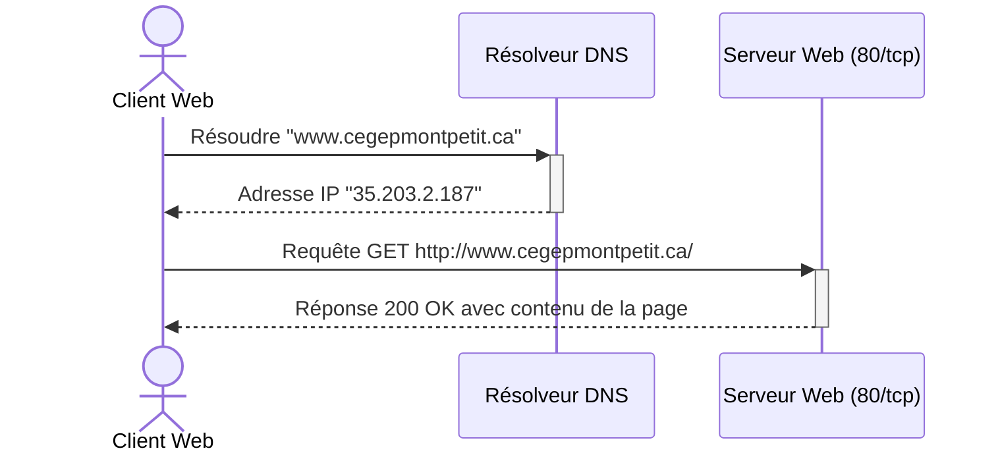
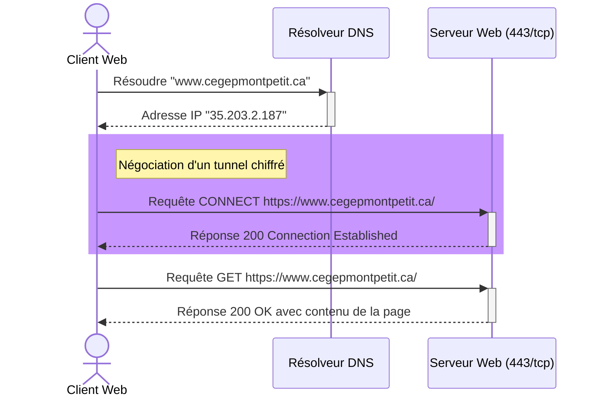
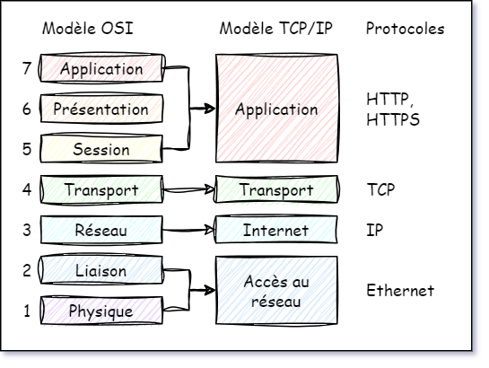

## Rappel sur HTTP et HTTPS

Le protocole HTTP (HyperText Transfer Protocol) est un protocole de communication utilisé notamment pour transférer des données sur le Web. Il existe dans sa version classique (HTTP) ainsi que sous une forme sécurisée (HTTPS).

### HTTP

Lorsqu'un client souhaite lancer une requête HTTP à un serveur Web, voici ce qui se passe:

1. une requête DNS en clair part jusqu'au serveur DNS, habituellement celui de ton fournisseur d'accès
2. avec l'adresse IP récupérée, une requête HTTP part avec comme adresse IP celle que ton fournisseur t'a donné
3. la requête est reçu par le serveur Web sur son port 80, et ce dernier lui répond avec les données demandées (par exemple, le HTML de la page Web)

Dans la barre d'adresse du navigateur, on reconnaît une adresse HTTP par son URI qui débute par `http://` (on nomme cette partie de l'URI le *schéma d'URI*).





### HTTPS (sécurisé)

Le protocole HTTP est très peu utilisé de nos jours car les données sont échangées en clair sur le réseau. Cela constitue une vulnérabilité car si un attaquant arrive à intercepter la communication, il peut lire les données qui ne lui sont pas destinées. Une extension du protocole, nommée HTTPS (HyperText Transfer Protocol Secure), ajoute à HTTP une couche de chiffrement TLS (anciennement SSL). Cela permet de rehausser la confidentialité et l'intégrité des échanges entre le client et le serveur. Son schéma d'URI est `https://`.

HTTPS est désormais la norme pour communiquer avec un serveur Web. Le protocole HTTP non sécurisé est quant à lui considéré comme désuet et la plupart des navigateurs montrent une alerte de sécurité lorsqu'on essaie de se connecter à un site Web par ce protocole.

Le protocole fonctionne sensiblement de la même manière que HTTP classique, à deux exceptions près:
- Avant la transmission des données, le client et le serveur négocient une méthode de chiffrement (on appelle ça le *handshake*)
- Le port d'écoute du serveur est 443 au lieu de 80

Voici une illustration qui montre ce qui se passe lorsqu'un navigateur envoie une requête HTTPS:



### Encapsulation TCP/IP

Vous avez vu dans votre cours de réseaux locaux que les messages échangés entre deux hôtes dans un réseau TCP/IP sont constitués de plusieurs couches encapsulées les unes dans les autres.

Dans le cas d'un échange entre un client Web et un serveur Web, nous allons avoir :
- une **requête** HTTPS (couche application)
- découpée en **segments** TCP et envoyée sur un port spécifique (couche transport)
- envoyée dans des **paquets** IP vers une adresse IP spécifique (couche internet)
- transmise dans des **trames** ethernet sur le réseau local (couche d'accès réseau)




## Activité encryption et HTTPS 

> *Vote + discussion 5 minutes*

Quand on utilise HTTPS, cela signifie qu'une partie des informations est encryptée / non lisible par quelqu'un qui intercepte le traffic réseau.

Quand vous envoyez un paquet HTTP ou HTTPS, il y a:
1. un corps de la requête
2. les entêtes http, avec le corps, cela constitue la requête HTTP
3. la requête est découpée en segment TCP pour que TCP puisse envoyer puis reconstituer la requête à destination, on ajoute donc des entêtes TCP
4. chaque segment voyage sous la forme d'un paquet IP qui ajoute les entêtes comme l'adresse IP de la destination ou encore l'adresse de retour pour la réponse

Selon vous, à main levée HTTPS encrypte?
- uniquement 1. soit le corps
- 1 et 2 toute la requête
- 1 2 et 3
- 1 2 3 et 4 ... c'est top secure

## Le cheminement de notre requête HTTPS

1. on tape l'adresse dans le navigateur https://lapresse.ca/mapromoautomne
2. le navigateur cherche l'adresse IP de la partie hote de l'url https://**lapresse.ca**/mapromoautomne
3. une requête DNS (Domain Name Service) est envoyé au serveur DNS avec son adresse IP (mettons 8.8.8.8)
4. on récupère l'adresse IP du site 52.72.195.49
5. handshake (poignée de main) TCP
   -.notre ordinateur envoie une requête au serveur pour établir une connexion TCP
   - le serveur répond que la connexion est établie-
6. handshake SSL (ou HTTPS)
   - notre ordinateur envoie une requête de connexion SSL
   - le serveur répond avec son certificat et un ensemble d'algos de crypto possible
   - notre ordinateur renvoie une clé d'encryption de session encryptée pour le serveur et ses algos possibles
   - le serveur complète la configuration et renvoie une confirmation **à ce stade, le client et le serveur ont tous les 2 des clés d'encryption pour la session**
7. la requête est envoyée avec l'empilage suivant
   - un paquet IP avec 
     - **headers** l'adresse IP du destinataire (52.72.195.49), et l'adresse IP de retour
     - **contenu** un segment TCP avec:
       - **headers** un numéro de segment, un port source, un port destination (HTTPS = 443 ici)
       - **contenu** une partie de la requête HTTPS ENCRYPTEE avec les clé négociées pendant le handshake
         - **headers** l'url (https://lapresse.ca/mapromoautomne), les cookies, le user agent, la méthode HTTP (ici GET)
         - **corps** si c'est une requête POST ou PUT, vide s'il s'agit d'une requête GET comme dans l'exemple
6. Une requête peut être découpée en plusieurs segments TCP ensuite envoyés par plusieurs paquets
7. le serveur reçoit la requête, la décrypte
8. il prépare la réponse, l'encrypte
9. il renvoie la réponse dans une segment TCP (avec le port source) dans un paquet IP (avec l'adresse IP source)
10. le navigateur peut décrypter la réponse et afficher son contenu

Références:
- https://www.cloudflare.com/learning/ssl/what-happens-in-a-tls-handshake/
- https://fr.wikipedia.org/wiki/Transport_Layer_Security

## Attaque de type Man in the Middle

Imaginons que quelqu'un de pas mal équipé a réussi à:
- effectuer un DNS spoofing sur mon url www.superprof.ca
- il a donc réussi à faire en sorte que les serveurs DNS renvoie son adresse IP au lieu de la nôtre pour www.superprof.ca
- l'utilisateur envoie alors sa requête au serveur du pirate qui établit une connection HTTPS
   1. pour chaque requête il la reçoit, l'ouvre pour voir le contenu puis il envoie une requête avec les mêmes informations au serveur réel le nôtre.
   2. quand il reçoit la réponse de ce serveur, il l'ouvre la lit puis produit une réponse identique pour le client.
 
Ce pirate voit tout le traffic, le client ne se rend compte de rien, le serveur non plus ... aaaaaahhhhhhhh le monde moderne s'écroule.

### La solution : le certificat SSL

Quand un site établit des connexions SSL avec des clients, c'est parce qu'il a un certificat SSL. 
Ce certificat est signé par une autorité de certification (CA) qui garantit que le site est bien celui qu'il prétend être.

Il s'agit encore ici d'encryption asymétrique. Le certificat contient une clé publique qu'il publie mais aussi une clé
privée que l'attaquant de type "man in the middle" ne peut pas obtenir en contacter le site réel et il ne 
peut donc pas répliquer entièrement le comportement du serveur.

Avec cette solution, on ne peut plus se placer en "man in the middle" si le certificat est signé et valide. Par contre, si l'attaquant a eu accès à votre poste et que vous avez une version modifiée de Chrome, on ne peut rien garantir. Mais ça on l'a déjà vu:
```
poste client corrompu = tout est foutu
```


# VPN 

## Ce que fait un VPN

- l'ordinateur client établit une connexion avec le serveur VPN
- tout le traffic réseau est encrypté et acheminé jusqu'au serveur VPN et dans le sens retour
- depuis le serveur VPN, le traffic est émis sur Internet mais avec une adresse IP différente

Tout se comporte comme si votre ordinateur se trouvait dans le réseau du serveur VPN.

## Ce que clame les VPN (10 minutes)

Si on regarde les publicités des VPN, on nous promet plein de trucs. On va essayer de faire le tri.

### Une connexion super rapide

- Est-ce que ça peut aller plus vite que la connexion internet de la maison?
- Qu'est-ce que ce serait un VPN lent?

### Te protège contre les virus et les malwares

- Des virus ou malware qui viennent d'où? une requête sur un navigateur? un courriel?

### Te protège contre les sites malveillants

- Plausible? comment ça marcherait?

### Est super encrypté, top secure

- Qu'est-ce qui est encrypté?
- C'est encrypté jusqu'au serveur VPN? jusqu'au serveur de destination?


# Quiz de mi-période et prise de notes (5 minutes)

Qu'est-ce qui est encrypté lors de l'envoi d'une requête HTTPS et justification:
- le port TCP?
- l'adresse IP?
- l'url?

Au delà de vos réponses, il faut que vous commenciez à prendre des notes pendant les cours pour:
- le résultat des conversations / exercices
- les questions que vous posez et les réponses reçues

Il s'agit d'une compétence importante pour votre vie de pro.

# Cookies, traqueurs, incognito

## Une page web, une requête? Qui reçoit des requêtes quand je navigue sur Internet? (5 minutes par toi-même)

Nous allons utiliser l'inspecteur de Chrome pour regarder quels sont les cookies que tu envoies à quels sites.

Pour commencer, pars un fichiers **cookies-suivi.md** dans ton dossier / repo pour le cours
- indique dedans un site d'information que tu consultes parfois
- indique un site de commerce en ligne que tu utilises parfois

Tu vas maintenant explorer un peu les cookies:
- ouvre les outils de dev dans un navigateur Chrome (dans n'importe quelle page, clic droit > inspecter)
- dans les outils de dev, tu trouveras plusieurs onglets (Elements, console, sources etc.)
- on va s'intéresser à **Network** et **Application**
- ouvre d'abord le site d'information que tu as choisi
- choisi l'onglet **Network** dans les outils
- recharge la page, tu devrais voir 
  1. une ligne du temps qui représente les différentes requêtes réseau 
  2. une liste en dessous avec chaque requête
- dans le champs **filter** on va taper d'abord 
  - **google.com** pour voir si des requêtes sont partis chez Google
  - **facebook** pour voir si des requêtes sont allées chez Facebook
- explore les requêtes trouvées 
  - en regardant l'onglet Headers du détail, 
  - trouver l'URL demandée (Request URL) pour vérifier que la requête part bien chez Google ou Facebook
- Copie l'url du site que tu demandée (pour moi lapresse.ca) et l'url envoyée à Google dans ton fichier de notes (MD)

### Retour en classe (5 minutes)

Nous allons discuter ensemble sur les questions suivantes:
1. Pourquoi le site que j'explore envoie autant de requêtes à autant d'autres sites
2. Par exemple, pourquoi un site envoie des requêtes à Google ou Facebook

## Cookies, traqueurs

Une petite histoire sur comment la page Facebook de Catherine lui affiche une annonce pour la pergola qu'elle avait regardé sur le site de Canadian Tire 3 semaines plus tôt.

1. Il y a 10 ans, Catherine a créé son profil Facebook. Depuis elle est toujours connecté sur son Chrome. Elle fait toute sa navigation depuis.
2. Quand elle s'est connectée sur Facebook, un cookie d'authentification s'est ajouté dans son navigateur. Par la suite toutes les requêtes envoyées sur une url en ****.facebook.com envoie ce cookie pour l'authentifier.
3. Il y a 3 semaines en naviguant sur le site de Canadian Tire, Catherine ne le sait pas mais la page envoie une (ou plusieurs requêtes) à Facebook. Là, ça devient intéressant: Canadian Tire ne sait pas que c'est Catherine car le cookie n'est envoyé que dans la requête vers facebook.
   - Catherine pense interagir uniquement avec un site Canadian Tire en regardant les photos d'une super pergola
   - En fait elle envoie des requêtes à plein de site
   - A Facebook elle envoie une requête qui indique l'url du produit et donc le produit
4. Aujourd'hui, elle ouvre sa page Facebook pour voir des photos de sa petite fille
5. Bim, une pub pour la maudite pergola:
   - Facebook sait que cette page a été explorée dans le passé
   - Canadian Tire a payé pour que Facebook affiche des pubs sur Facebook
   - Facebook a un algo qui comprend qu'afficher cette pub a du potentiel.

### Utilisation normale? Risque de tracker malicieux

Dans une utilisation normale / légale, elle permet à quelques grandes entreprises de 
1. fixer un cookie de traçage (qui identifie un utilisateur de leur plateforme), un sur chaque appareil connecté au compte
2. sur chaque site partenaire, envoyer un requête indiquant la page visitée pour permettre de collecter la trajectoire de la personne
3. pour la plupart des usagers d'Internet, presque toutes les pages peuvent être tracées par la grande entreprise

En résumé, si quelqu'un a un compte Google, qu'elle fait toute sa navigation dans un navigateur connecté à son compte et qu'elle visite essentiellement des gros sites web, il est probable que Google a **tout** son historique internet.

### Mode incognito, navigation privée etc.

Un mode privé ou secret dans un navigateur va habituellement:
- ne pas stocker les pages visitées dans l'historique
- ne pas envoyer les cookies précédemment existant (mais il va accumuler les cookies de la session privée)
- parfois certains navigateurs vont restreindre l'envoi des cookies de traçage

En exercice, démarre une session en navigation privée dans Chrome. Lis la description fournie et vois si tu comprends tout ce qui est écrit après le cours d'aujourd'hui.


