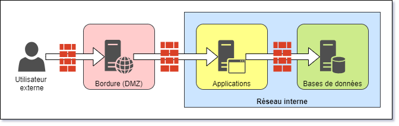
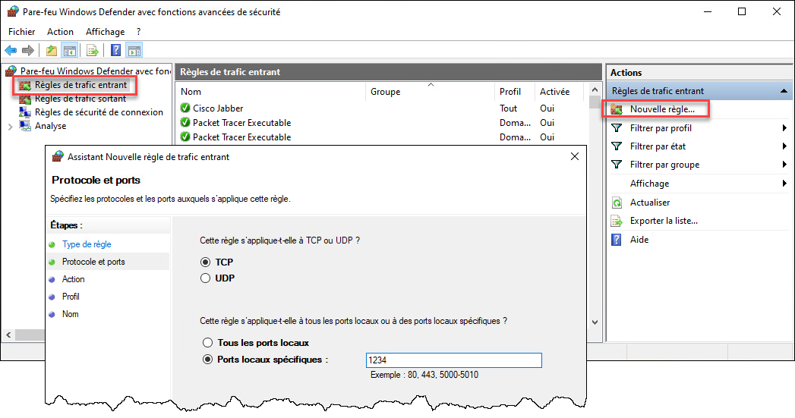

Vous avez sans doute entendu dire qu'un pare-feu sert à vous protéger des attaques provenant du réseau. Mais comment ça marche au juste?


## Les ports d'écoute

Tous les ordinateurs sur un réseau jouent à la fois le rôle de client et de serveur. Dans une dynamique client-serveur, le client est la machine qui utilise un service alors que le serveur est celle qui rend le service au client. Le client s'attend normalement à ce que le serveur doit disponible au moment où il souhaite passer sa requête, donc le serveur doit écouter en tout temps sur le réseau. 

Le serveur doit donc être accessible sur le réseau. Les clients le contactent au moyen de son adresse IP. Le serveur ouvre un **port d'écoute** correspondant au protocole de communication utilisé par convention pour chaque service. Par exemple, un navigateur Web (appelé aussi un client Web) passe ses requêtes HTTPS sur le port 443 du serveur, et donc le serveur Web a ouvert son port 443 pour recevoir les requêtes des clients.


### Identifier les ports ouverts

Normalement, un système d'exploitation ouvre un port d'écoute à la demande d'un programme (ou service) qui s'exécute en arrière-plan.

On peut utiliser la commande `netstat -a` sous Linux et Windows afin d'obtenir la liste de tous les ports ouvert en écoute (en mode *LISTENING*).

```
C:\> netstat -a

Connexions actives

  Proto  Adresse locale         Adresse distante       État
  TCP    0.0.0.0:135            MABELLEMACHINE:0       LISTENING
  TCP    0.0.0.0:445            MABELLEMACHINE:0       LISTENING
  TCP    0.0.0.0:902            MABELLEMACHINE:0       LISTENING
  TCP    0.0.0.0:912            MABELLEMACHINE:0       LISTENING
  TCP    0.0.0.0:2179           MABELLEMACHINE:0       LISTENING
  TCP    0.0.0.0:2701           MABELLEMACHINE:0       LISTENING
  TCP    0.0.0.0:3389           MABELLEMACHINE:0       LISTENING
  TCP    0.0.0.0:5040           MABELLEMACHINE:0       LISTENING
  TCP    0.0.0.0:5985           MABELLEMACHINE:0       LISTENING
  TCP    0.0.0.0:7680           MABELLEMACHINE:0       LISTENING
  ...    ...                    ...                    ...
```


### Quelques ports bien connus

Les ports TCP et UDP utilisés par les différents protocoles sont établis par convention dans les documents des normes d'Internet (les RFC). Voici certains ports bien connus pour des protocoles fréquemment utilisés:

| Protocole | Port(s) | Document de norme (RFC, autre...) |
| :-- | :-- | :-- |
| HTTP | 80/tcp | [RFC 2616](https://tools.ietf.org/html/rfc2616) |
| HTTPS | 443/tcp | [RFC 2818](https://tools.ietf.org/html/rfc2818) |
| FTP | 21/tcp | [RFC 959](https://tools.ietf.org/html/rfc959) |
| SSH | 22/tcp | [RFC 4251](https://tools.ietf.org/html/rfc4251) |
| Telnet | 23/tcp | [RFC 854](https://tools.ietf.org/html/rfc854) |
| SMTP | 25/tcp | [RFC 5321](https://tools.ietf.org/html/rfc5321) |
| DNS | 53/tcp/udp | [RFC 1035](https://tools.ietf.org/html/rfc1035) |
| DHCP | 67/udp (serveur), 68/udp (client) | [RFC 2131](https://tools.ietf.org/html/rfc2131) |
| POP3 | 110/tcp | [RFC 1939](https://tools.ietf.org/html/rfc1939) |
| MS-RPC | 135/tcp/udp (epmap), 49152-65535/tcp/udp (dyn)  | [MS-RPCE](https://learn.microsoft.com/en-us/openspecs/windows_protocols/ms-rpce/290c38b1-92fe-4229-91e6-4fc376610c15) |
| IMAP | 143/tcp | [RFC 3501](https://tools.ietf.org/html/rfc3501) |
| LDAP | 389/tcp | [RFC 4511](https://tools.ietf.org/html/rfc4511) |
| SMB | 445/tcp | [MS-SMB](https://learn.microsoft.com/en-us/openspecs/windows_protocols/ms-smb/f210069c-7086-4dc2-885e-861d837df688) |
| LDAPS | 636/tcp | [RFC 4511](https://tools.ietf.org/html/rfc4511) |
| Microsoft SQL Server| 1433/tcp, 1434/udp | [MC-SQLR](https://learn.microsoft.com/en-us/openspecs/windows_protocols/mc-sqlr/1ea6e25f-bff9-4364-ba21-5dc449a601b7) |
| NFS | 2049/tcp | [RFC 3010](https://tools.ietf.org/html/rfc3010) |
| MySQL | 3306/tcp | (non spécifié par une RFC) |
| Bureau à distance (RDP) | 3389/tcp | [MS-RDPBCGR](https://learn.microsoft.com/en-us/openspecs/windows_protocols/ms-rdpbcgr/5073f4ed-1e93-45e1-b039-6e30c385867c) |
| PostgreSQL | 5432/tcp | (non spécifié par une RFC) |


## Vulnérabilités

Un port ouvert n'est pas forcément un problème, bien au contraire: les ports d'écoute sont un élément essentiel au fonctionnement d'Internet. Tous les serveurs Web doivent obligatoirement écouter sur le port 443 et les serveurs SSH doivent obligatoirement écouter sur le port 22. Toutefois, plus les ports ouverts en écoute sont nombreux, plus le serveur répond à une multitude de protocoles et plus les chances que l'un de ces protocoles (ou du logiciels logiciel qui l'implément) soit vulnérable. 

Par ailleurs, un port ouvert permet à une machine distante d'envoyer une requête au serveur, ce qui entraîne un traitement plus ou moins important, dépendant de la nature de la requête. Par exemple, une requête Web à un serveur déclenche une série d'actions sur le serveur: interprétation de la requête, validation de la session ou du cookie, formulation d'une requête à la base de données, interprétation du résultat, production dynamique de code HTML, renvoi de la réponse au client. Ce travail peut être exploité à des fins de déni de service distribué (DDoS), car ces attaques visent justement à surcharger les ressources computationnelles de l'ordinateur cible.


## Correctifs

Chaque port constitue un point d'entrée potentiel pour les attaques. On dit alors que la surface d'exposition est grande. Il est donc important de limiter les ports ouverts à seulement ce qui est nécessaire pour que le service fasse son travail (à l'instar du principe du plus bas privilège pour les permissions). Il y a plusieurs manières d'y parvenir.


### Fermer ou désactiver le service

On peut limiter la surface d'exposition en désactivant les services dont notre système n'a pas besoin. Par exemple, si notre machine sert strictement de serveur Web et rien d'autre, on devrait voir uniquement les ports TCP 443 (et peut-être aussi 80) en écoute. Si d'autres ports sont ouverts, il faut identifier le programme qui écoute sur le port et y mettre fin.

:::tip Identifier le programme derrière un port ouvert
Autant sous Linux que sous Windows, la commande `netstat -ano` permet d'obtenir la liste des ports ouverts (en mode "LISTENING") ainsi que l'identifiant du processus en exécution (PID). Vous pouvez ensuite retrouver le programme responsable dans le gestionnaire de tâches de Windows ou encore la commande `ps -ef | grep <PID>` sous Linux. Vous pouvez ensuite tenter de découvrir comment ces services sont démarrés (par exemple, `/etc/init.d` sous Linux, `serviecs.msc` sous Windows...). 
:::

### Pare-feu local

Il n'est parfois pas possible ou souhaitable de désactiver complètement le service, car ce service a une utilité. Par exemple, il arrive que les administrateurs de système aient besoin du service SSH pour administrer le serveur à distance. Ça ne veut pas dire qu'on doit exposer ce port à tout Internet. Il se peut aussi qu'on souhaite empêcher à un utilisateur non-administrateur d'ouvrir un port (ça ne prend normalement pas de droits d'administration, seulement la capacité à lancer un programme qui ouvre un port). On utilise alors un pare-feu.

Le pare-feu est un logiciel dont l'objectif est de contrôler les entrées et sorties sur le réseau en laissant passer le trafic légitime et en bloquant le trafic indésirable. Il y a deux grandes catégories de pare-feux: le pare-feu local, qui tourne sur le serveur, et le pare-feu d'infrastructure, qui tourne sur d'autres équipements.

Linux Ubuntu et Windows possèdent tous deux un pare-feu local prêt à l'emploi. Dans les deux cas, il faut disposer des privilèges d'administrations pour modifier sa configuration. Ce pare-feu opère sur la machine et n'a donc aucun effet sur les autres systèmes, mais permet de bloquer des ports en amont et en aval. Il peut aussi être configuré de sorte qu'un port ne puisse être ouvert que par un programme spécifique.


### Pare-feu d'infrastructure

Le pare-feu d'infrastructure est un dispositif de sécurité déployé sur un réseau. Ce n'est pas un logiciel installé sur un serveur mais plutôt une machine à part entière en bordure de deux réseaux. Tout le trafic réseau passe par lui, qui se réserve le droit de laisser passer les paquets ou les détruire, un peu comme un poste de douane. Ainsi, même si on est administrateur de notre machine et qu'on laisse passer le trafic au moyen du pare-feu local, celui-ci pourrait ne pas pouvoir franchir le pare-feu d'infrastructure en bordure.

Une telle solution est très souvent implémentées dans les réseaux d'entreprises. Non seulement on dispose un pare-feu en bordure pour filtrer les requêtes provenant des utilisateurs externes, dans une zone isolée du réseau qu'on nomme la zone démilitarisée (DMZ), mais même dans le réseau interne on segmente le réseau en plusieurs sous-réseaux, chacun séparés par un pare-feu. Ainsi, par exemple, il n'y a que l'application qui peut se connecter au serveur de base de données.

Le diagramme suivant montre un exemple d'une telle architecture, qu'on appelle l'architecture 3-tiers.



Les pare-feux d'infrastructure sont souvent des produits commerciaux professionnels. Les principaux pare-feux sur la marché incluent:
- Cisco ASA
- Fortinet FortiGate
- Palo Alto Networks NGFW
- pfSense / NetGate

Plusieurs de ces pare-feux sont dits de "nouvelle génération" et offrent des fonctionnalités d'analyse de trafic, de filtrage de paquets et peuvent même procurer un service de VPN.

:::info Question quiz!
Est-ce qu'un pare-feu peut bloquer:
- L'accès au site web https://www.criminels.net
- L'accès à http://info.cegepmontpetit.ca (pour forcer l'utilisation de https)?
- L'accès à la page https://www.supersupersuper.com/pageinterdite.html (sans bloquer le reste du site)?
:::


## Configuration du pare-feu

La configuration du pare-feu se fait normalement au moyen de règles de filtrage de paquets. 

### Critères
Les règles sont basées sur plusieurs critères, notamment:
- L'adresse IP et le port de source
- L'adresse IP et le port de destination
- Le protocole utilisé (TCP, UDP, ICMP)

D'autres critères sont possiblement supportés par le pare-feu. Par exemple, le pare-feu de Windows permet d'ajouter un programme spécifique à une règle ainsi qu'un profil réseau (par exemple, un réseau privé vs. un réseau public). Aussi, certains pare-feux avancés peuvent inspecter le contenu des paquets pour détecter des menaces (pourvu que la communication ne soit pas chiffrée ou que le pare-feu puisse la déchiffrer).

### Types de règles
Typiquement, on peut définir deux types de règles:
- Les règles d'autorisation (allow) permettent le passage du trafic correspondant aux critères spécifiés
- Les règles de blocage (deny) bloquent le trafic réseau correspondant aux critères spécifiés

### Direction
Le pare-feu est en mesure de contrôler le trafic dans l'une ou l'autre des directions:
- Les règles de trafic entrant contrôlent le trafic qui est initié par un client distant vers nous.
- Les règles de trafic sortant contrôlent le trafic qui est initié par nous vers un serveur.

### Ordre des règles
Dans certains pare-feux, l'ordre des règles est important. Les règles de filtrage sont généralement évaluées dans un ordre séquentiel. Le pare-feu examine chaque paquet et applique la première règle correspondante. Si aucune règle ne correspond, une action par défaut (généralement le blocage) est appliquée. Ce ne sont toutefois pas tous les pare-feux qui fonctionnent comme ça: celui de Windows, par exemple, ne tient pas compte de l'ordre des règles.

:::caution Désactiver complètement le pare-feu?
Il peut être tentant de désactiver complètement le pare-feu pour "régler" un problème de connectivité. La désactivation du pare-feu (ou la création d'une règle très permissive) est rarement une solution définitive. Il peut être acceptable de désactiver le pare-feu temporairement, pour tester ou pour confirmer si le blocage provient du pare-feu, mais on doit le réactiver le plus rapidement possible.
:::


## Pare-feux locaux

### Pare-feu de Windows

Sous Windows, on peut gérer le pare-feu par le panneau de configuration "Pare-feu Windows Defender". Vous pouvez gérer les règles entrantes et sortantes en cliquant sur "paramètres avancés" ou en ouvrant la console `wf.msc`. Vous y trouverez un ensemble de règles que vous pouvez modifier. Sachez toutefois que dans un environnement d'entreprise (comme au CÉGEP Édouard-Montpetit), le pare-feu de Windows est généralement contrôlé centralement par les administrateurs du domaine.



### Pare-feu de Linux (Ubuntu)

Voici un site qui explique le fonctionnement du pare-feu par défaut de Linux Ubuntu

https://documentation.ubuntu.com/server/how-to/security/firewalls/


## Démo: Capture de ports avec WireShark

Nous allons accéder le serveur http://perdus.com qui est plus simple parce qu'il fonctionne en HTTP simple
1. ouvrir chrome et taper http://perdus.com mais sans appuyer sur enter
2. ouvrir firefox et taper http://perdus.com mais sans appuyer sur enter
3. ouvrir Wireshark et démarrer la capture sur l'interface ethernet
4. vite aller taper enter dans chrome et firefox
5. arrêter la capture Wireshark le bouton carré rouge
6. on va regarder les différentes requêtes HTTP qui ont été faites et en particulier les ports source / destination


## Exercices

### Exercice 1: Fermeture de ports entrant

Le prof va partir un script qui teste l'ouverture d'un port sur tous les postes du local.

De ton côté, tu vas devoir fermer le port 445 (trafic entrant). Ce port correspond au protocole SMB (partage de fichiers Windows) sur ta machine.

Tu peux démarrer la console du pare-feu de Windows avec la commande `wf.msc` lancée à partir d'une invite de commande ou du menu Démarrer.


### Exercice 2: Fermeture de ports sortant

:::caution
Tu ne pourras plus accéder à la plupart des sites pendant que la règles sera active, y compris OneDrive. Sauvegarde tes données avant de continuer.
:::

Tu dois ajouter une règle dans le pare-feu de Windows pour bloquer le port **443** (HTTPS) en sortie. 

Tu devrais être capable de naviguer sur des sites en HTTP mais pas en HTTPS. Pour tester un site en HTTP, tu peux utiliser http://perdus.com/.

Quand tu as fini, tu peux simplement désactiver la règle ou la supprimer pour restaurer la connectivité.


### Exercice 3: Interdire l'accès à un site Web

Dans cet exercice, on veut interdire l'accès à un site Web spécifique, sans bloquer l'ensemble d'Internet.

1. En utiliant la commande `nslookup`, trouve les adresses IP pour l'hôte **info.cegepmontpetit.ca**.
2. Ne garde que les adresses **IPv4**.
3. Crée une règle dans ton pare-feu pour bloquer ces adresses IP en sortant sur le port **443**, ça te prend une règle **personnalisée**.

Essaie de naviguer dans l'interface du pare-feu et de trouver comment créer la règle. L'interface est relativement intuitive, mais si tu bloques quelque part, tu peux demander l'aide de ton prof.


