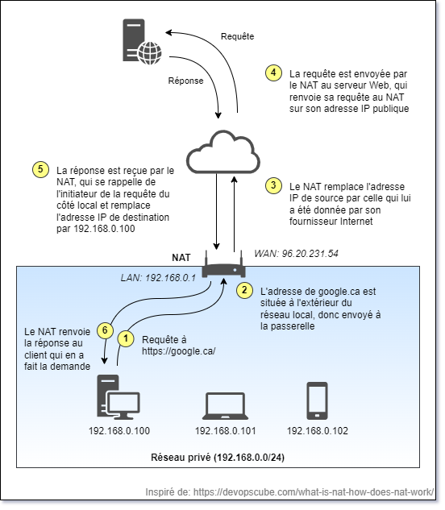

# Intro

Dans cette session, nous allons parler des différentes solutions de prise de controle à distance. 
Nous allons voir les avantages et inconvénients de chaque solution.

## Prise de contrôle à distance

## NAT, services à distance ou scammer

### C'est quoi NAT?

Avec IP v4, nous avions des IP sur 32 bits. Cela faisait 4 milliards d'adresses ce qui semblait énorme au départ. Evidemment avec le succès, on a eu plus de 4 milliards d'appareils nécessitant une IP. Est arrivé NAT pour **Network address translation**:

On va distinguer 
   - une adresse publique sur l'internet (**unique pour toute l'humanité**) 
   - une adresse privée sur un réseau local (**unique sur le réseau local**)

Si on reprend une requête qui part 
- vers un serveur avec l'IP 45.45.45.45 en https donc sur le port 443 
- depuis la machine avec l'IP 192.168.0.110
- via le routeur de la maison auquel mon fournisseur a attribuê l'adresse 40.40.40.121

Les étapes suivantes se passent:
- le paquet arrive au routeur avec comme 
  - port de destination 443
  - port de retour 4545
  - ip de destination 45.45.45.45
  - ip de retour 192.168.0.110
- le routeur voit que le paquet s'en va hors du réseau et il va faire la traduction suivante
  - l'adresse de retour (privée = 192.168.0.110) va être remplacé par la sienne (publique = 40.40.40.121)
  - le port de retour va être remplacé par une valeur au hasard disponible dans la table de NAT mettons 1023
  - il crée une entrée dans sa table NAT avec 
    - le port de retour original (4545)
    - le port de retour modifié (1023)
    - l'adresse IP locale (192.168.0.110)
- les routeurs IP de l'internet acheminent les paquets à la machine du serveur
- le serveur recoit la requête avec le bon port toutes les informations et la traite
- le serveur produit une réponse avec le numéro de port de retour (1023) et l'adresse IP source 40.40.40.121
- les routeurs IP de l'internet acheminent les paquets au routeur de la maison 40.40.40.121
- le routeur de la maison effectue les étapes suivantes:
  - il regarde le port de retour soit 1023
  - il regarde dans la table de NAT, s'il y a une entrée
  - si c'est le cas comme dans l'exemple il envoie un paquet modifié avec
    - IP destination 192.168.0.110
    - port 4545
  - s'il ne trouve rien, le paquet est ignoré, rien n'est envoyé sur le réseau local

Quelques observations:
- il y a une modification d'adresse IP et port à l'aller et au retour
- on part de l'hypothèse que le protocole respecte les conventions IP et TCP sur les adresses et ports
- s'il n'y a pas de paquet qui est sorti du réseau local, un paquet ne peut pas arriver au routeur et être envoyé à une machine avec adresse privée

#### Questions / discussions

Selon vous, si 2 ordinateurs de ma maison sur le Wifi envoient tous les 2 des requêtes au même serveur
comment le routeur peut savoir à quel ordi, il doit envoyer une réponse quand elle arrive de l'internet?

Si à chaque fois que j'envoie une requête vers l'internet, il se crée une entrée dans une table de NAT,
depuis le temps comment la mémoire vive de mon routeur n'a pas explosé?

### Quand je suis à la maison c'est quoi mon adresse IP?

### Ce qui marche quand j'initie depuis l'intérieur du NAT mais pas autrement

### Le cas du gars gentil

Paul doit prendre le contrôle de la machine d'un client perdu Jean. Jean est derrière un NAT. Selon vous:
- Est-ce que Paul peut utiliser une application qui envoie directement une demande à la machine de Jean? Mettons qu'il y a un serveur SSH sur la machine de Jean?
- Si ce n'est pas le cas, comment on fait?

Notre responsabilité surtout en IT est de s'assurer que la solution qu'on utilise pour administrer à distance n'ouvre pas une brèche pour hacker à distance.

### Le cas du scammer sans scrupule qui opère de l'étranger

1. Marie-Thérèse reçoit un texto qui lui indique que son compte à la BMO a été piraté.
2. Elle doit cliquer sur un lien pour résoudre le problème.
3. Quand elle clique sur le lien elle arrive sur une page qui décrit le problème et indique au scammer qu'il a une victime potentielle.
4. Il appelle sur le numéro de Marie-Thérèse, elle est devant son ordinateur sur la page du scammer
5. Il lui demande de télécharger un logiciel pour résoudre son problème.
6. Comme le site lui montre une page qui ressemble à celle de sa banque avec un montant de 0$, elle panique
7. La personne est une femme elle parle doucement et Marie-Thérèse est rassurée
8. Elle télécharge le logiciel qui initie une communication avec un serveur à travers son NAT
9. Le scammer peut maintenant via le même serveur communiquer directement avec le poste de Marie-Thérèse

Une fois que c'est fait, le scammer peut:
- collecter toutes les frappes clavier en mode keylogger
- accéder aux fichiers

Il n'est pas obligé d'obtenir des informations personnelles de la personne puisque l'application 
installée peut collecter des données, réinitier des communications plus tard avec le serveur etc.

----------

### Les passerelles NAT

Le NAT (Network Address Translation) est une technique utilisée dans les réseaux informatiques pour modifier les adresses IP dans les en-têtes des paquets IP en cours de transit à travers un routeur ou un pare-feu. On utilise souvent cette technique lorsqu'on a plus de machines dans notre réseau interne que d'adresse IP publiques à notre disposition.

Par exemple, à la maison, votre fournisseur d'accès Internet vous donne une seule adresse IP publique, routable sur Internet. Toutefois, vous avez plus d'une machine à la maison (ordinateurs, cellulaires, tablettes, télés connectées, etc.)

Comment est-ce possible?

La passerelle NAT possède deux catégories d'interfaces réseau: une interface WAN (*wide area network*), du côté de votre fournisseur Internet, et une ou plusieurs interfaces LAN (*local area network*). La passerelle agit comme serveur DHCP du côté LAN pour assigner une adresse IP privée à tous les hôtes de votre réseau local (typiquement dans la plage 192.168.x.x ou 10.x.x.x). Dès que votre ordinateur tente d'envoyer un paquet IP vers Internet, le NAT intercepte ce paquet et modifie l'adresse IP de la source pour son adresse publique. Il envoie le paquet au serveur tout en gardant une copie de l'échange dans sa mémoire. Dès que la passerelle NAT reçoit la réponse du serveur, il regarde dans sa liste pour savoir quelle machine de son réseau interne a envoyé le paquet, puis modifie à nouveau l'entête du paquet et le renvoie au demandeur.

Le fonctionnement du NAT est différent de celui d'un pare-feu car il ne fonctionne pas au moyen de règles de filtrage. Il procure quand même un bon niveau de protection contre les attaques provenant d'Internet en rendant invisible de l'extérieur toutes les machines du réseau local. Si un attaquant tente de se connecter à mon ordinateur se situant derrière un NAT, c'est le NAT qui recevra la requête, et comme cette communication n'a pas été initiée par ma machine, le NAT détruira tout simplement cette requête.

